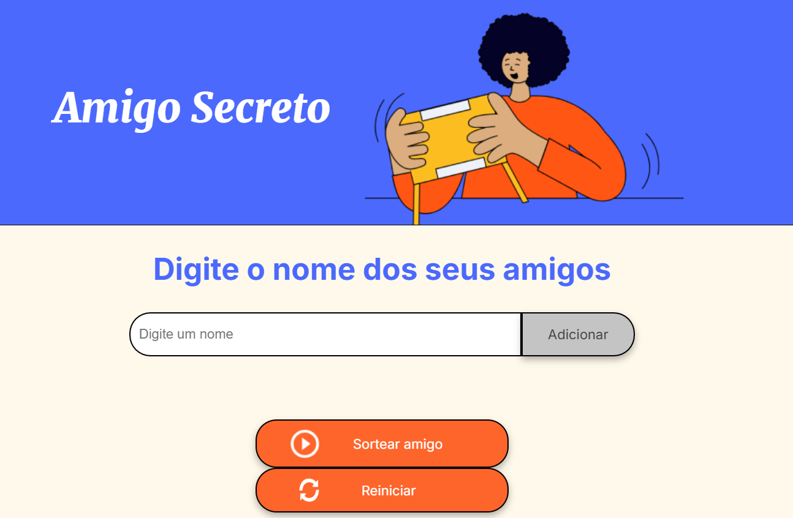
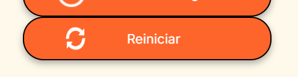
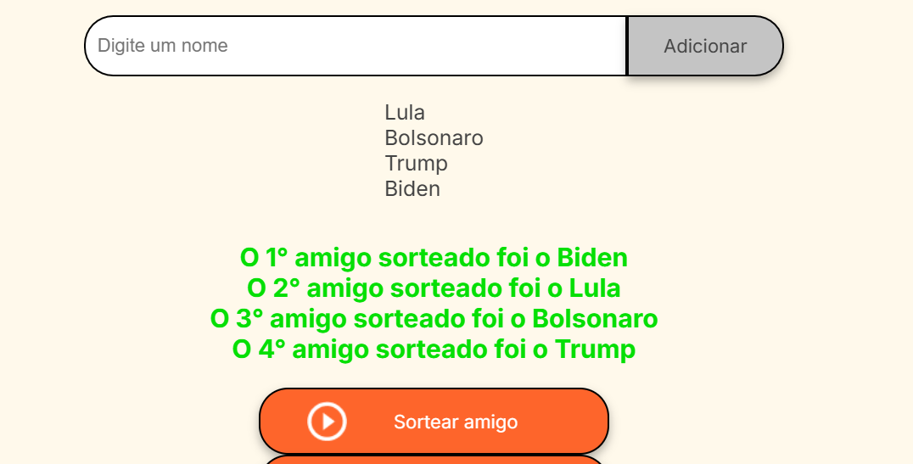
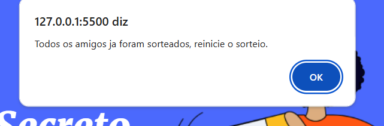

<h1>Sorteio do Amigo Secreto</h1>
<h3>Este web service foi desenvolvido para facilitar o processo de sorteios de nomes de pessoas. </h3>
<h3>Utilizando apenas HTML, CSS  e JavaScript, este web service possui uma interface totalmente intuitiva. </h3>

# Contribuição
### Os arquivos HTML e CSS foram disponibilizados pela equipe da Alura responsavel pelo projeto, e ficou a cargo de nós estudantes desenvolvermos a parte lógica que no caso é o JavaScript, baseado nas últimas aulas que tivemos.

# Bônus do projeto inicial
### 1. Foi acrecentado um botão de para resetar o sorteio.

### 2. A função de sortear quantos amigos o usuário quiser sem repetir 
### o nome de amigos ja sorteados.

### 3. Caso todos sejam sorteados, uma mensagem de aviso 
### solicita o reinicio do sorteio

# Link para o Sorteador
### https://challenger-amigo-secreto-gules.vercel.app/

# Sobre mim

## Me chamo Gilmar Pereira
### Sou Professor de Informática numa escola pública.
### Estudo programação desde meados de 2024.
### Sou fã de animes e metal, pai de dois filhos e marido de uma flor.

